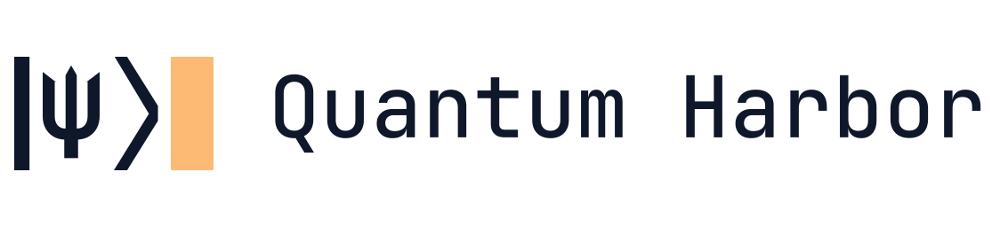
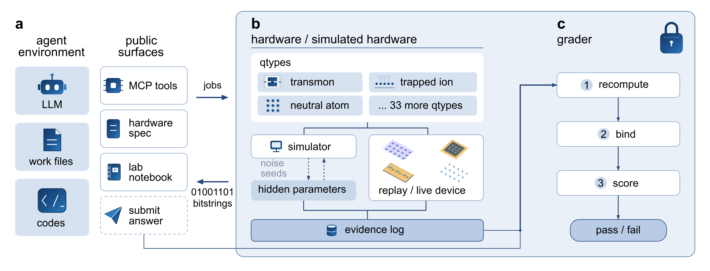

<p align="center">
  <picture>
    <source media="(prefers-color-scheme: dark)" srcset="docs/images/quantum-harbor-logo-dark.svg">
    <source media="(prefers-color-scheme: light)" srcset="docs/images/quantum-harbor-logo-light.svg">
    
  </picture>
</p>

<p align="center">
  <a href="https://arxiv.org/abs/2609.17439"></a>
  <a href="https://gauge-forge.com/qiqc"></a>
  <a href="LICENSE"></a>
</p>

Quantum-Harbor is the AI agent quantum laboratory framework for [Evaluating Verified Autonomy in Quantum Engineering](https://arxiv.org/abs/2609.17439).

## How it works

<p align="center">
  <picture>
    <source media="(prefers-color-scheme: dark)" srcset="docs/images/fig_framework_dark.png">
    
  </picture>
</p>

Quantum-Harbor builds on [Harbor](https://github.com/harbor-framework/harbor), a framework for running agents on sandboxed tasks. Quantum-Harbor provides two environments.

- **Agent environment.** The agent harness (Codex, Claude Code, or another Harbor agent) works here
  with the task instruction and its own files. It reaches the hardware only through MCP tools:
  read the device spec and a lab notebook whose calibrations may be stale, submit experiment jobs,
  fetch raw results, and submit a final answer.
- **Sidecar.** A qtype simulates the device under hidden device and noise parameters. An evidence
  log records every experiment job. The agent container holds no copy of the hidden parameters and
  cannot write to the log.

When the agent finishes, a grader runs in a separate verifier container. 

## Installation

You need Docker, [uv](https://docs.astral.sh/uv/), and git. The installation check below was run end
to end with Harbor 0.18.0.

```bash
uv tool install 'harbor==0.18.0'
git clone https://github.com/GaugeForge/Quantum-Harbor
cd Quantum-Harbor
uv sync
```

Build the agent image, then the sidecar image and one verifier image per task. The first build
takes about 20 minutes.

```bash
docker build -t qiqcbench-agent docker/agent/
uv run python tools/build_qsim_images.py
```

## Quick start

Check the installation with Harbor's `nop` agent. It needs no API key. The task starts, the agent
does nothing, and after about two minutes the grader records a reward of 0.

```bash
harbor run -p harbor_tasks/time_budgeted_hamlearn_10q -a nop
```

Run an agent on one task and open the results:

```bash
export OPENAI_API_KEY=<your key>
harbor run -c configs/harbor/time_budgeted_hamlearn_10q_codex.yaml
harbor view jobs
```

Each config in [`configs/harbor/`](configs/harbor/) names an agent and a model. To run a different
model, pass both `-a` and `-m`, because Harbor applies `-m` only together with `-a`. To run a bundle
without a config, use `harbor run -p harbor_tasks/<task> -a <agent> -m <model>`. See the
[quick start](docs/getting-started/quick-start.md) for details.

## Released tasks

| Task | What the agent must do |
|---|---|
| [`time_budgeted_shadow_surrogate_60q`](harbor_tasks/time_budgeted_shadow_surrogate_60q/instruction.md) | Learn a classical surrogate for all 1770 pair-correlation functions of a hidden 60-qubit circuit under a hard shot and job budget, then predict a precommitted held-out panel. |
| [`tunable_coupler_cz_netzero`](harbor_tasks/tunable_coupler_cz_netzero/instruction.md) | Design and calibrate a high-fidelity net-zero CZ on a tunable-coupler transmon pair, through a realistic control stack (DAC samples, flux-line distortion, predistortion). |
| [`logical_cnot_decoder_calibration`](harbor_tasks/logical_cnot_decoder_calibration/instruction.md) | Calibrate the decoding layer of a small fault-tolerant processor: a distance-5 memory and a lattice-surgery logical CNOT, with hidden circuit-level noise. |
| [`adaptive_clustered_clbcs_h2o`](harbor_tasks/adaptive_clustered_clbcs_h2o/instruction.md) | Design an adaptive composite-measurement scheme for a fixed 14-qubit H2O Hamiltonian and one hidden state, then estimate the energy with a correct 1-sigma uncertainty. |
| [`time_budgeted_hamlearn_10q`](harbor_tasks/time_budgeted_hamlearn_10q/instruction.md) | Learn the hidden coefficient vector of a sparse nearest-neighbor Hamiltonian on 10-qubit black-box analog hardware, within a total evolution-time budget. |


## Documentation

| Page | Contents |
|---|---|
| [Installation](docs/getting-started/installation.md) | Requirements, Harbor version, image builds |
| [Quick start](docs/getting-started/quick-start.md) | Installation check, first agent run, results |
| [Core concepts](docs/core-concepts.md) | Agent environment, sidecar, qtypes, evidence log, grader |
| [Task overview](docs/tasks/overview.md) | Bundle format and the public and hidden split |
| [Released tasks](docs/tasks/released-tasks.md) | Tools, budgets, and submission format of each task |
| [Grading](docs/tasks/grading.md) | Separate verifier, rewards, score reports, exit codes |
| [Run a job](docs/jobs/run-a-job.md) | Run configs, agents, models, credentials |
| [Results](docs/results.md) | Where rewards, reports, and evidence land |
| [Sidecar](docs/qsim/sidecar.md) | Running the sidecar without Harbor, MCP tools, backend modes |
| [Qtypes](docs/qsim/qtypes.md) | All 36 hardware abstractions |

## Citation

```bibtex
@article{guo2026verified,
  title   = {Evaluating Verified Autonomy in Quantum Engineering},
  author  = {Guo, Naixu and Li, Changhao and Cheng, Siyu and Tang, Qicheng and
             Luo, Binzhao and Li, Bikun and Du, Yuxuan and Ru, Shihao and Cai, Jiaqi},
  journal = {arXiv preprint arXiv:2609.17439},
  year    = {2026}
}
```

Software citation metadata is in [CITATION.cff](CITATION.cff).

## License

MIT. See [LICENSE](LICENSE).
