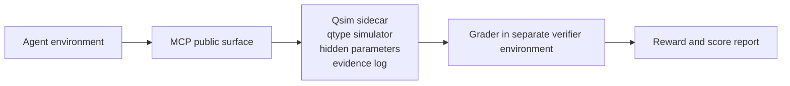

# Quantum-Harbor documentation

Quantum-Harbor is a virtual quantum laboratory built on Harbor. These pages explain how to install it, run the five released QIQCBench tasks, and read the results.

## Getting started

- [Installation](getting-started/installation.md): Install the tested toolchain and build the images.
- [Quick start](getting-started/quick-start.md): Run a check job, make an agent attempt, and open the results.

## Core concepts

- [Core concepts](core-concepts.md): Follow an experiment from the agent environment to the grader.

## Tasks

- [Overview](tasks/overview.md): Read a task bundle and its public and private inputs.
- [Released tasks](tasks/released-tasks.md): Compare the five included task objectives, tools, budgets, and submissions.
- [Grading](tasks/grading.md): See how collected evidence reaches a separate verifier.

## Jobs

- [Run a job](jobs/run-a-job.md): Choose a run configuration, task, agent, model, and concurrency.

## Results

- [View job results](results.md): Find trial rewards, score reports, and collected evidence.

## Qsim

- [Sidecar](qsim/sidecar.md): Run the sidecar without Harbor and see its MCP tools and backend modes.
- [Qtypes](qsim/qtypes.md): Browse the 36 hardware abstractions (qtypes).
